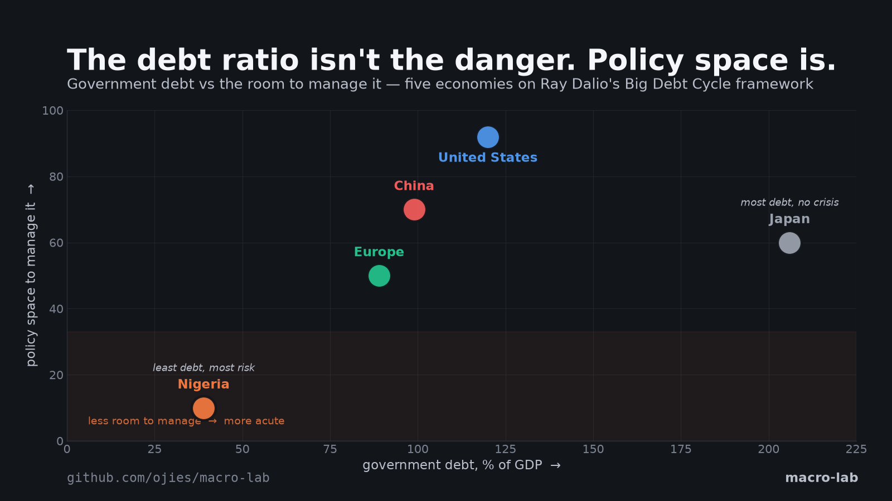
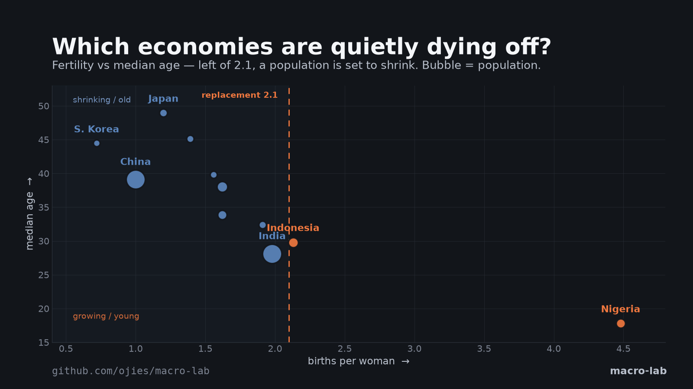
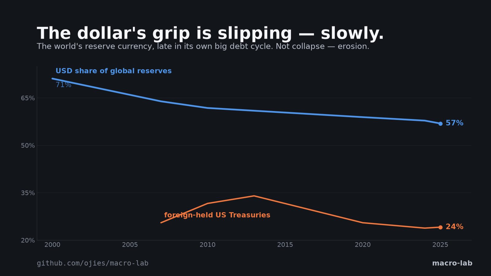
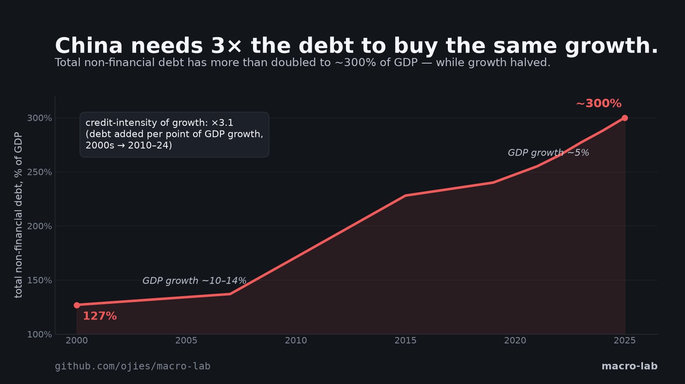

# docs — shareable figures

Social/preview cards generated from the macro-lab models (1600×900).

| Image | Shows |
|---|---|
|  | **The debt ratio isn't the danger — policy space is.** Five economies on Dalio's Big Debt Cycle framework: Nigeria carries the least debt (39%) and the most risk; Japan the most (206%) and no crisis. |
|  | **Which economies are quietly dying off?** Fertility vs median age — left of the 2.1 replacement line, a population is set to shrink. Korea 0.72, five majors in natural decline, Nigeria still doubling. |
|  | **The dollar's grip is slipping — slowly.** USD share of global reserves 71% → 57% since 2000; foreign-held Treasuries 34% → 24%. Erosion, not collapse — the US is late in its own big debt cycle. |
|  | **China needs 3× the debt to buy the same growth.** Total non-financial debt 127% → ~300% of GDP as growth halved — the credit-intensity of growth has tripled. |

Regenerate: the source values come from `informal_economy_ai_bitcoin/debt_cycle/` (`compare_poles.py`, `demographics.py`, `usa_debt_cycle.py`, `china_model.py`).
